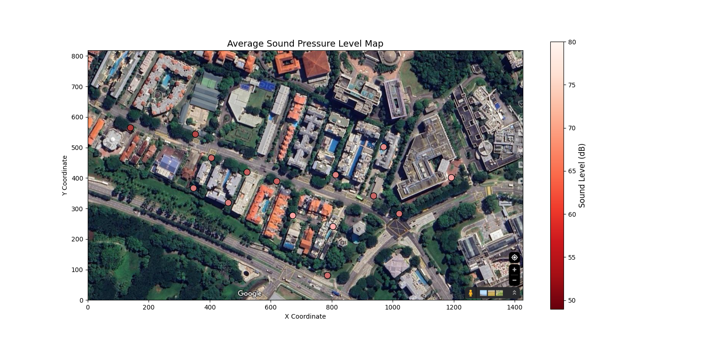
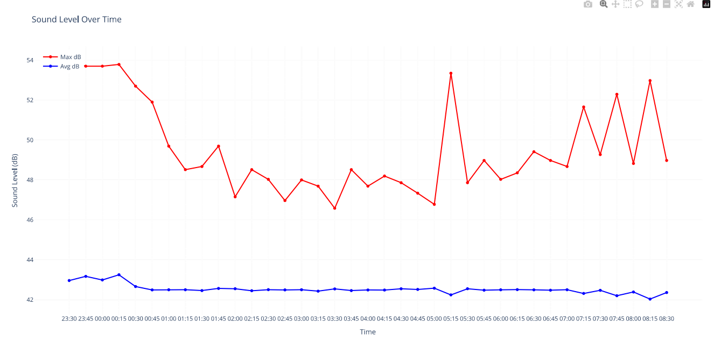

# ME5106 Engineering Acoustics - Noise Analysis and Its Impact to Sleep Report
## Abstract
Noise pollution has become a significant environmental concern, particularly due to its adverse effects on human health and well-being. This report investigates nighttime noise levels at Murano (351 Pasir Panjang Rd, Singapore 118693) over a one-week period (February 20–26, 2025), focusing on their impact on sleep quality. The study utilizes real-time and scheduled data acquisition methods, employing tools such as the Decibel X app and Python-based automated recording systems. Results reveal that noise levels frequently exceed the World Health Organization’s recommended thresholds for undisturbed sleep, with peak noise events primarily attributed to vehicular traffic along major roads like Pasir Panjang Road and West Coast Highway. The analysis identifies critical periods of elevated noise exposure and suggests optimal sleep timings to minimize disturbances. Potential mitigation strategies, including vegetative buffers and soundproofing measures, are discussed to address these challenges and improve residents' sleep quality.
## 1. Introduction
### Brief overview of noise pollution and its impact to sleep.
Noise pollution, unwanted or excessive sound that can have deleterious effects on human health, wildlife, and environmental quality. Noise pollution is commonly generated inside many industrial facilities and some other workplaces, but it also comes from highway, railway, and airplane traffic and from outdoor construction activities.And it carries a significant disease burden to humans health.[1]

Sleep is a vital component of human life that serves many critical roles in physical and mental health and well-being. Sufficient quantity and quality of sleep are requirements for optimal daytime alertness and performance, and high quality of life. Experimental studies suggest that restricted sleep duration causes blood vessel dysfunction, induces changes in glucose metabolism，and appetite regulation, and impairs memory consolidation. Accordingly, epidemiological studies have consistently found that chronic short or interrupted sleep is associated with negative health outcomes, including obesity, diabetes, hypertension, cardiovascular disease, all-cause mortality, and poorer cognitive function. Chronic insufficient or disrupted sleep is therefore of public health relevance, and sleep disturbance is considered a major adverse consequence of exposure to environmental noise.[2]

The burden of nonisy to sleep had widly influenced the human health all over the world.In 2011, the World Health Organization (WHO) attributed the burden of noisy disease to noise-induced sleep disturbance, with 903,000 disability-adjusted life years lost annually in Western Europe alone.[3].In 2018, the WHO published recommendations for protecting human health from exposure to environmental noise.[4]

Sleep deprivation has emerged as a significant public health crisis in Singapore, with environmental noise potentially serving as a contributing factor to this issue. A recent survey conducted across 43 cities, examining the sleep habits of their residents, ranked Singapore as the third most sleep-deprived city globally. Alarmingly, only one in four individuals reported obtaining more than seven hours of sleep per night, while a mere 17% of respondents indicated that they sleep uninterrupted through the night [5] . Situated along the Strait of Malacca, Singapore boasts a highly developed transportation infrastructure. Furthermore, the government has demonstrated a strong commitment to preserving the nation’s natural environment, which is characterized by rich biodiversity. However, noise generated from aircraft, maritime shipping activities, and natural wildlife may collectively contribute to ambient noise levels, posing potential disruptions to the sleep quality and overall health of Singapore residents.
This report provides a systematic investigation into nighttime noise levels (10:00 PM to 9:00 AM) over a one-week period (February 10–16, 2025) at Murano (351 Pasir Panjang Rd, Singapore 118693). The study encompasses an analysis of various noise sources and incorporates rigorous numerical assessments to evaluate their characteristics and implications.

## 2. Methodology
### 2.1 Measurement Equipment and Setup

#### Real-Time Data Acquisition

For real-time noise level measurement, the **Decibel X** application was utilized. Decibel X is a robust and user-friendly sound level meter (SLM) app designed to measure sound intensity or noise levels in the environment. It leverages the device's microphone to detect ambient sound levels and displays the results in decibels (dB). One of the key features of Decibel X is its ability to allow users to adjust measurements based on external calibration devices, thereby enhancing measurement accuracy. This feature ensures that the data collected is reliable and consistent with professional-grade equipment.

In this study, real-time data acquisition was performed using an **iPhone 13 Pro** equipped with the Decibel X app. The device was calibrated prior to data collection to ensure precision.

#### Scheduled Data Acquisition

For scheduled noise data collection during nighttime, an automated setup was implemented using a **Windows-based computer** running Python scripts. The audio data was recorded in the **WAV format**, which uses linear PCM encoding to preserve the original waveform information. This format is particularly advantageous for subsequent acoustic analysis, as it supports calculations in both the time and frequency domains, as well as statistical acoustic parameter extraction.

The recording process utilized the **sounddevice** library for capturing audio and the **scipy.io.wavfile** module for saving the data in WAV format. A custom Python script was developed to automate the recording process, enabling scheduled noise data collection at regular intervals. Specifically, the system was programmed to record audio every 15 minutes, with each recording lasting 1 minute, from 22:00 to 10:00 the following morning. This schedule covers the majority of people's sleep hours, ensuring comprehensive nighttime noise monitoring.

#### Calibration Methods and Accuracy Check

Calibration of the measurement equipment was conducted using a **calibrated sound level meter**. The principle of calibration involves measuring a known sound pressure level source and comparing it with the readings displayed by the device under test. The difference between the measured value and the reference value is used to calculate the error, which is then applied to correct the device's output.

In this study, the calibration was performed in the **Natinal Univeristy of Singapore E1#02-03 Acoustics Lab**. The **Decibel X app** on an **iPhone 13pro** was used as the reference device for calibration. The iPhone was equipped with original Apple earphones, while the computer used a Huawei Classic USB Type-C headset for audio input. During the calibration process, the iPhone's Decibel X app showed a deviation of **+2 dB**, while the computer's microphone exhibited a deviation of **+194.31 dB**. These deviations were accounted for during data processing to ensure accurate results.

Additionally, the computer's microphone was calibrated against the iPhone's Decibel X app to minimize discrepancies in the scheduled recordings. This dual-calibration approach ensured that both real-time and scheduled data collection methods produced reliable and consistent results.
### 2.2 Data Collection Procedure
#### Measurement Locations and Justification

The noise measurements were conducted around **Murano @ 351, Pasir Panjang Road, Singapore 118693**, a residential area surrounded by various potential noise sources. 

A detailed **sound map** of the surrounding area was created to visualize noise distribution patterns. The choice of these locations was justified by their relevance to daily living conditions and their potential impact on residents' quality of life, particularly during nighttime when noise disturbances are most disruptive.

#### Time Intervals and Data Collection Schedule

The data collection schedule was designed to cover **evening**, and **night**, as well as **weekends**, to account for variations in noise levels throughout sleep time. For real-time measurements, data was collected manually using the calibrated iPhone 13 Pro with Decibel X on **February 21, 2025, at 23:30**.

For scheduled nighttime measurements, the automated system was programmed to record noise levels every **15 minutes**, with each recording lasting **1 minute**, from **23:15 to 9:00** the following morning. This interval was chosen to ensure sufficient temporal resolution while minimizing storage requirements. The selected timeframe encompasses the typical sleep duration for most individuals, making it particularly relevant for assessing nighttime noise pollution and its potential impact on sleep quality.

## 3. Analysis of Data Collected
### 3.1 Noise Level Trends
#### Nighttime Noise Levels
The World Health Organization (WHO) has established guidelines for nighttime outdoor noise levels, setting an ideal target of no more than 40 decibels (dB) for optimal human health. However, in cases where current noise levels are significantly higher, a transitional target of 55 dB is considered acceptable as an interim measure[6]
Based on these guidelines, nighttime noise levels can be classified as follows:

 - 0-40 dB : Excellent nighttime noise level, conducive to undisturbed sleep and overall well-being.
 - 40-55 dB : Acceptable nighttime noise range with minimal impact on sleep quality.
 - Above 55 dB : Noisy environment, likely to severely disrupt human sleep patterns and negatively affect health.
#### Average and Maximum Noise Levels at Different Locations
The experiment was conducted along Pasir Panjang Road, located to the south of the National University of Singapore (NUS) and to the north of the West Coast area. Measurements were taken during the time interval of 23:00–01:00 under dry weather conditions with no rainfall. At each measurement point, data was collected over a duration of 120 seconds, capturing two key parameters: the average sound pressure level (SPL) and the maximum sound pressure level (SPL).

The equipment used for the measurements included the DecibelX application running on an iPhone 13 Pro. The geographical range of the measurements is illustrated in Figures 1 and 2. Based on the collected data, two maps were generated: Figure 1 depicts the average sound pressure levels in decibels (dB), while Figure 2 illustrates the maximum sound pressure levels (SPL) across the study area. This setup allowed for a detailed analysis of noise levels at different locations, providing insights into both the ambient noise environment and peak noise events during the specified time intervals.
Noise mapping refers to the process of utilizing acoustic simulation software to generate noise distribution maps on geographic planes and building facades. These maps are typically validated and corrected using actual noise measurement data. The resulting visualizations employ different colors, contour lines, grids, or color gradients to represent varying levels of noise intensity. In this project, a simplified noise map was created using Python code, with specific color representations for noise levels: deep green (RGB: 0, 100, 0) was used to denote the highest sound pressure levels recorded during data collection, while light green (RGB: 173, 255, 147) represented the lowest sound pressure levels.
The generated noise map reveals significant variations in sound pressure levels along West Coast Highway and Pasir Panjang Road. Notably:
- Peak Noise Levels :Along these major roads, 100% of the recorded peak values exceeded 55 dB, indicating elevated noise pollution in these areas at times. The highest peak noise level of 79.2 dB was recorded at Palm Mansions, located adjacent to Pasir Panjang Road, with the primary noise sources being passing vehicles, including cars and motorcycles. The lowest peak noise level among the highest recorded points was 57.3 dB, observed at the Institute of Microelectronics.
- Average Noise Levels :Among the 14 measurement points, three points exhibited average noise levels in the range of 40–55 dB. These points were characterized by their proximity to Science Park Road and West Coast Highway but relative distance from the high-traffic Pasir Panjang Road. Despite their proximity to major roads, these points did not exhibit average noise levels that reached the unacceptable range.
The two Noise Levels Figure is shown as follow:

The three main roads have their characters:[6]
- Pasir Panjang Road : A major arterial road connecting Singapore's southern ports (e.g., PSA Terminal) to the city center. It experiences significant freight traffic, particularly related to port logistics.
- West Coast Highway : A key expressway along Singapore's western coastline, connecting industrial zones, port areas, and the city center. Like Pasir Panjang Road, it carries substantial freight traffic.
- Science Park Road : An important road within the One-North district, linking high-tech parks such as Biopolis and Fusionopolis, as well as research institutions and enterprises. Freight traffic on this road is relatively low and concentrated during morning and evening peak hours.

The side of the study area adjacent to West Coast Highway features multi-layered vegetation (trees, shrubs, and grass), which serves to absorb traffic noise. In contrast, the Murano residential complex, located near a major road without a vegetative buffer, was selected for a comparative study. Measurements were conducted on February 23, 2025, between 23:00 and 01:00, comparing noise levels with windows closed versus open. The results showed:
- Windows Closed : Average noise level of 43 dB.
- Windows Open : Average noise level of 63 dB.

Within the scope of this study, the primary factor influencing nighttime noise exposure for residents is the proximity to major freight roads, where elevated noise levels are primarily generated by vehicular traffic. These noise impacts can be mitigated through several strategies:
1. Increasing the distance between residential areas and major freight roads.
2. Establishing vegetative buffers, such as roadside and residential greenery, to absorb and reduce noise.
3. Encouraging the use of noise-reducing measures within homes, such as keeping windows and doors closed during high-noise periods.

### 3.2 Noise Cruve and the best sleep time
#### Objective:
To determine the optimal bedtime for uninterrupted sleep by analyzing nighttime noise levels in a residential environment under controlled conditions.
#### Equipment and Calibration:
A Huawei Classic USB Type-C headset was used as the recording device. Prior to data collection, the headset's sensitivity and frequency response were characterized using calibrated iphone 13pro. The calibration process ensured that the recorded SPL values were accurate within ±1 dB across the audible frequency range (20 Hz–20 kHz).
The sampling frequency was set to 44,100 Hz, consistent with high-fidelity audio recording standards.
#### Experimental Setup:
Recordings were conducted in a room within the Murano residential complex. All doors and windows were sealed to minimize external airflow and noise infiltration. The only appliance operating in the room was an air conditioner, set to a temperature of 25 degrees Celsius. Additionally, I did not reside in the room during the testing period to exclude any noise generated by my presence from affecting the experiment.
#### Noise Source Verification:
Public transportation schedules in Singapore were obtained from official transit authorities to correlate observed noise patterns with operational timings.[7]
Main noise source : Cars and motorcycles traveling on Pasir Panjang Road
Additional noise sources : Wild red junglefowl crowing during the early morning hours (3:00 AM to 7:00 AM) and ship horn signals from PSA Pasir Panjang Terminal.

#### Results:
Average SPL values ranged between 40–55 dB, which aligns with acceptable thresholds for sleep according to WHO guidelines. However, significant variability was observed before 00:45, with occasional peaks exceeding 60 dB.
Maximum SPL values exhibited a clear diurnal pattern, with higher levels before 00:45 and after 07:00. These findings were corroborated by public transportation schedules, which indicated increased activity during these periods.
#### Conclusion:
Based on the observed noise patterns and assuming a 7-hour sleep duration, the optimal bedtime under the given conditions is no later than 00:45. This timing minimizes exposure to elevated noise levels during critical sleep phases.
Future studies should incorporate objective sleep quality metrics (e.g., polysomnography) to validate the relationship between noise exposure and sleep outcomes.

## 4. Discussion
### Insights on Noise Level Variations
The analysis of nighttime noise levels reveals significant variations across different time intervals and locations within the study area. Noise levels were generally higher during the early evening hours (23:00–00:45), likely due to ongoing vehicular traffic and public transportation operations. After 00:45, noise levels decreased, reaching their lowest point between 01:00 and 07:00. However, a noticeable increase in noise was observed after 07:00, coinciding with the resumption of morning traffic and industrial activities. These fluctuations highlight the influence of human activity patterns on ambient noise levels.

### Possible Reasons for Fluctuations in Noise Levels
Several factors contribute to the observed fluctuations in noise levels. First, proximity to major freight roads, such as Pasir Panjang Road and West Coast Highway, significantly impacts noise exposure. These roads experience substantial vehicular traffic, particularly freight vehicles, which generate high-intensity noise. Second, the absence of vegetative buffers in certain areas exacerbates noise pollution, as evidenced by higher noise levels recorded near Murano compared to areas with multi-layered vegetation. Third, weather conditions and building layouts also play a role in modulating noise propagation.

### Impact of Noise on Comfort, Sleep, and Daily Activities
The findings underscore the detrimental effects of elevated nighttime noise levels on sleep quality and overall well-being. Noise levels exceeding 55 dB, as recorded during peak events, are likely to disrupt sleep patterns and impair physiological recovery processes. Residents exposed to such noise levels may experience increased risks of chronic health issues, including cardiovascular diseases and cognitive impairments. Furthermore, the psychological stress induced by persistent noise exposure can negatively affect daily activities, reducing productivity and quality of life.

### Comparison Between Different Locations in the Home
A comparative analysis of noise levels inside Murano with windows closed versus open highlights the importance of structural design in mitigating noise exposure. With windows closed, the average noise level was reduced to 43 dB, falling within the acceptable range for sleep. In contrast, keeping windows open resulted in an average noise level of 63 dB, which is considered disruptive. This finding emphasizes the need for effective soundproofing measures, particularly in residential areas adjacent to high-traffic zones.

## 5. Conclusion
- Summary of key findings.
- Practical implications of the results.
- Recommendations for future noise assessments or improvements.

## 6. References
 [1] Britannica. (n.d.). Noise pollution. Retrieved from https://www.britannica.com/science/noise-pollution
 [2] Environmental Health Perspectives. (n.d.). The impact of sleep deprivation on health. Retrieved from https://ehp.niehs.nih.gov/doi/10.1289/EHP10197
 [3] World Health Organization (WHO). (2011). Burden of disease from environmental noise. Retrieved from https://iris.who.int/bitstream/handle/10665/326424/9789289002295-eng.pdf
 [4] World Health Organization (WHO). (2018). Guidelines for protecting human health from exposure to environmental noise. Retrieved from https://iris.who.int/handle/10665/279952
 [5] Lee Kuan Yew School of Public Policy, National University of Singapore. (n.d.). Sleep deprivation in Singapore: A public health crisis. Retrieved from https://lkyspp.nus.edu.sg/gia/article/sleep-deprivation-in-singapore-a-public-health-crisis
 [6] SBS Transit. (n.d.). Public transportation schedules and services in Singapore. Retrieved from https://www.sbstransit.com.sg/Service/BusService
 [7] World Health Organization. (2009). World health statistics 2009 . Retrieved from https://www.who.int
ISBN: 9789241563819

